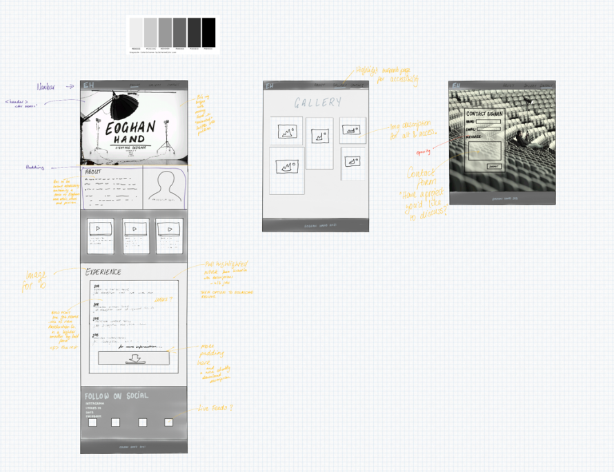
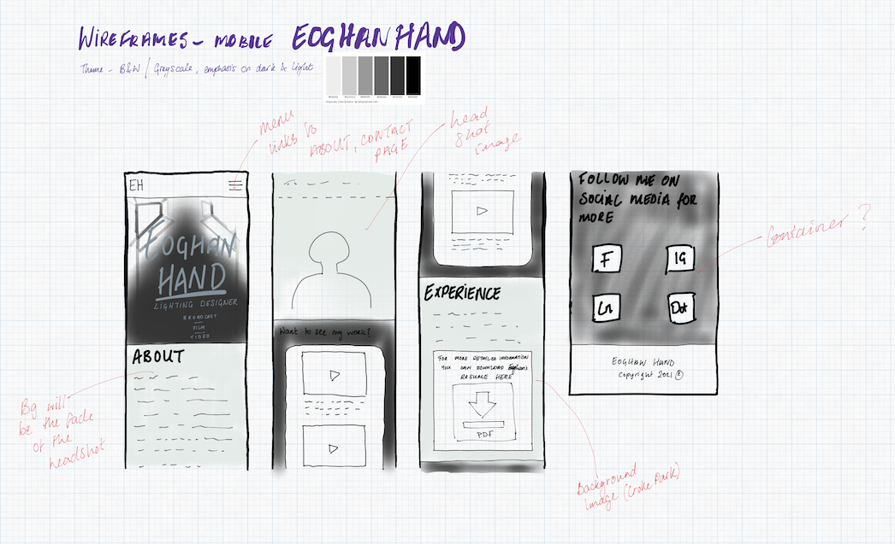

<h1>Eoghan Hand</h1>
<h2>Lighting Designer for Broadcast, Film and Video</h2>

This portfolio website is designed to showcase the skills of Irish Lighting Designer, Eoghan Hand. Eoghan works mostly in broadcast, film and video and the aim of this site is to present his skills, passion and experience for this area to potential employmers and other creative minds he will collaborate with.

View deployed site here: |[Handy Lighting Design](https://katelyn234.github.io/HandyLighting-Design/)|

<h2>UX</h2>
<h3>User Stories</h3>

As a potential employer I expect to be able to access details of Eoghan's previous work and his contact information easily. 

As a potential collaborator I expect to see samples of Eoghan's work and a sense of his work ethic.

<h3>Strategy</h3>

The function of this product is to inform, with that in mind the main goal of the website is to compile a portfolio of works into a comprehensive accessible design.

<h3>Scope</h3>

The target audience for this site's traffic was narrowed down to two profiles; 
<h4>Creative Agencies:</h4>
    <ul>
        <li>Production Companies</li>
        <li>Marketing Companies</li>
        <li>Executives</li>
    </ul>

<h4>Creative Individuals:</h4>
    <ul>
        <li>Producers</li>
        <li>Directors</li>
        <li>Other Creatives</li>
    </ul>

Creative Agencies most likely require downloadable information, such a PDF resume. Whereas Creative Individuals will be looking for examples of creative expression.

<h3>Structure</h3>

The landing page of the website is designed to establish the who the site is about and what they do. The About page is an opportunity to express a 'sense of self' on the site while also informing about work ethics and ethos. The Portfolio follows the About to further reiterate creative style and passion. This is followed by more detailed information on previous works and a downoadable Resume, and finally links to follow Eoghan's Social Medias. 

The Gallery page is compiled of at-work stills, behind the scenes stills etc. to futher reinforce Eoghan's brand. 

The Contact Page aims to encourage people to engage with Eoghan by pitching their project. This enables Eoghan to streamline his decision process on taking on new projects.

<h3>Skeleton</h3> 

 
    
 

<h3>Surface</h3>

The grayscale theme was chosen for this project to illustrate the contrast between the light and dark, a most appropriate theme for a lighting designers website.

<h2>Features</h2>

<h3>Existing Features</h3>
	<ul>
		<li>This site features a Navbar that can be used to easily navigate the site, this Navbar is styled to remain at the top of the viewport throughout all pages of the site, ensuring easy access to it at all times. Highlight content is also pinned in the footer which appears on the bottom of the screen should the user not find what they are looking for before they get to the bottom of the site</li>
		<li>The Index.html page is divided into sections featuring highlighted information about Eoghan's work. This includes a showreel section where examples of work done are given, along with the corresponding video. There is also a Recent Experience section for those interested in seeing more/varied information (I.E which production companies Eoghan worked with and when) and to ensure there is more information accessible there is a downloadable PDF of Eoghan's current resume.</li>
		<li>This site features a masonry gallery of at work stills, this feature is present to create an "image" for the portfolio</li>
	</ul>

<h3>Future Features</h3>
	<ul>
		<li>Add a "Request a call back" section to the contact page. Customers input their email address and "request a call back button" and receive and email with Eoghan's Calendly. link</li>
		<li>Carousel for the showreel so more videos can be added.</li>
		<li>Lighting Gear Hire section, this feature would include a catalogue of Eoghan's kit ("inventory") with the applicable rates for hire, terms and conditions section, availability calendar plug in. Too large a feature to compile into this project.</li>
	</ul>

<h2>Technologies</h2>
    <ul>
        <li>This project was written using HTML and CSS languages.</li>
        <li>The project uses <a href="https://getbootstrap.com/">Bootstrap v5.0.2.</a></li>
        <li><a href="https://fontawesome.com/">Font Awesome</a> has been used for icons in the footer.</li>
        <li>This project uses <a href="https://fonts.google.com/specimen/Encode+Sans+SC?query=encode">Google Fonts (Encode Sans SC)</a></li>
        <li>Wireframes were drawn using <a href="https://concepts.app/en/">iOS Concept App</a></li>
        <li><a href="https://imagecolorpicker.com/">Image Color Picker</a> was used to match backgrounds to images</li>
        <li><a href="https://photoeditor.polarr.co/">Polarr</a> was the photo editor used to adjust all raw images</li>
    </ul>

<h2>Testing</h2>

[Testing.md](https://github.com/Katelyn234/HandyLighting-Design/blob/main/TESTING.md)
    

<h2>Deployment</h2>

    

<h2>Credits</h2>
    <h3>Photo Credits</h3>
        <ul>
            <li>"white-photo-studio.jpeg" image downloaded from <a href="https://www.shutterstock.com/image-photo/interior-modern-photo-studio-chair-professional-793002787">Shutterstock</a></li>
            <li>"studio-with-lights.jpeg" image downloaded from <a href="https://www.shutterstock.com/image-photo/empty-photo-studio-white-cyclorama-monoblocks-1894652761">Shutterstock</a></li>
            <li>This project was written using HTML and CSS languages.</li>
            <li>This project was written using HTML and CSS languages.</li>
            <li>This project was written using HTML and CSS languages.</li>
            <li>This project was written using HTML and CSS languages.</li>
            <li>This project was written using HTML and CSS languages.</li>
            <li>This project was written using HTML and CSS languages.</li>
            <li>This project was written using HTML and CSS languages.</li>
            <li>This project was written using HTML and CSS languages.</li>
            <li>This project was written using HTML and CSS languages.</li>
            <li>This project was written using HTML and CSS languages.</li>
            <li>This project was written using HTML and CSS languages.</li>
        </ul>

<h3>Video Credits</h3>
        <ul>
            <li>"allofthelights.jpeg"</li>
            <li>This project was written using HTML and CSS languages.</li>
            <li>This project was written using HTML and CSS languages.</li>
            <li>This project was written using HTML and CSS languages.</li>
            <li>This project was written using HTML and CSS languages.</li>
            <li>This project was written using HTML and CSS languages.</li>
            <li>This project was written using HTML and CSS languages.</li>
            <li>This project was written using HTML and CSS languages.</li>
            <li>This project was written using HTML and CSS languages.</li>
            <li>This project was written using HTML and CSS languages.</li>
            <li>This project was written using HTML and CSS languages.</li>
            <li>This project was written using HTML and CSS languages.</li>
            <li>This project was written using HTML and CSS languages.</li>
        </ul>

<h3>Code Credits</h3>
    <ul>
            <li>This project was written using HTML and CSS languages.</li>
            <li>This project was written using HTML and CSS languages.</li>
            <li>This project was written using HTML and CSS languages.</li>
        </ul>
    

<h2>Notes</h2>

